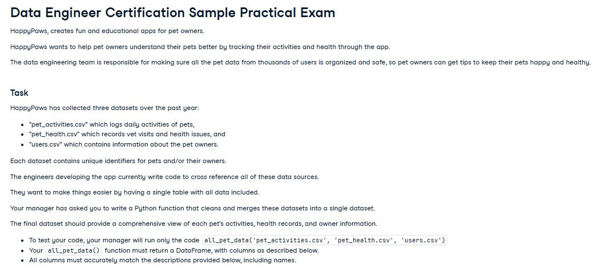
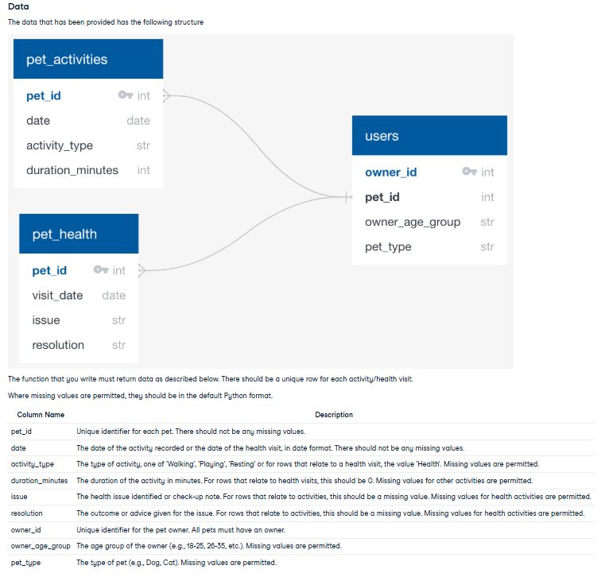

## Azure Blob Storage → PySpark → Pandas → Excel Report
## Overview

This project reads three pet-related CSV files from Azure Blob Storage, performs cleaning and validation using PySpark, converts the final DataFrame to Pandas, and generates an Excel report with visualizations. The idea is if these three files of pet data is pushed every night this would be a nightly scheduled report for the completed day.

Purpose
The goal of this project is to practice working with cloud-based storage in a realistic setting, where a company might use the cloud but not have a full end-to-end solution in place. While exploring Azure, I used the free $200 credit to create the following resources:
- Storage Account

- Resource Group

- Blob Container (with uploaded CSVs)

In addition to exploring Azure, I wanted hands-on practice with PySpark to get comfortable with its Pandas-like syntax and understand how it handles data — a good step toward distributed computing.

I also used this to highlight my experience with XlsxWriter, which lets me build charts directly in Excel. Instead of inserting images with matplotlib, I prefer giving managers access to the raw data or source tables on another tab. That way, there’s no need to ask, “Where did that number come from?”

While dashboards are common, many teams still rely on simple Excel files or CSVs, especially where centralized reporting isn't available.

I aimed to recreate a realistic scenario, like a manager saying:

“We’re getting files dropped off from a client in blob storage. It could become a daily thing, but for now, can you clean them up the way we usually do and generate a potential daily report?”

The file drop-off could just as easily be SFTP, but blob storage, S3, and Google Cloud Storage are all realistic delivery points. Instead of building a full pipeline, I focused on the kind of ad hoc request I’ve seen often which I'd like to beleive is a great foundation for scaling up to more complex pipelines.

# Tech Stack
Microsoft Azure – Blob Storage

PySpark – Data transformation (Practiced with PySpark syntax such as: .collect() and .repartition())

Pandas – Final cleanup and formatting (My bread and butter)

XlsxWriter – Excel report generation

Input:  Three csv's described below.

Output: Cleaned, merged data saved as an Excel file.

Includes pie, radar, and bar charts to summarize trends.

Next Steps:

While this is a simple, single-run workflow, it sets the stage for future enhancements like:

Scheduling with cron or Airflow

Parameterizing input files or output destinations

Deploying on a cloud VM or Function for automation

## Data Background
I enjoyed learning new concepts on Datacamp.com the site offered a sample Data Engineering pratical exam that you'd work on before going for the cerfiticate. It had good cleaning, transforming and merging tasks that needed to be complete.

Yes, it is not real data but the concept behind the problem is very possible. Here is a the description of the story behind the data:

The schema description and the final column conditions asked:

## Miscellaneous 

My previous project [MLB_StrikeZone_App](https://github.com/Vincent-Crescente/MLB_StrikeZone_App) was a lot of fun. As long as I returned data from the correct endpoints I received clean data in a good format. Maybe a 'B' and an 'S' needed to be replaced with a 'Ball' and 'Strike' but no real cleaning. Though this pyspark blob storage fun project wasn't with real data, the data came in dirty and needing to be merged, which is why I went with it.

